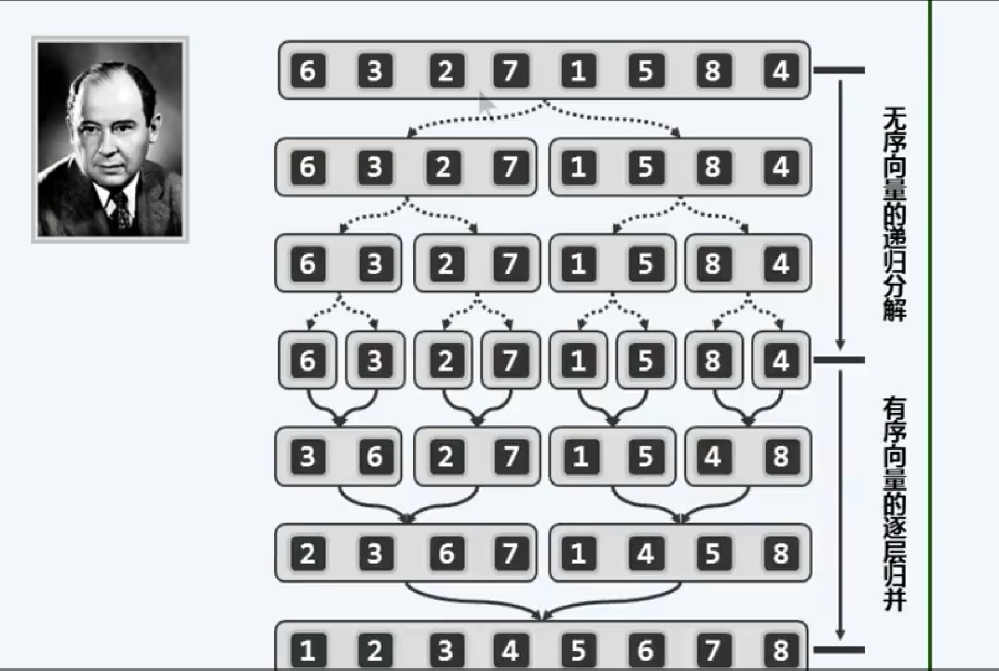
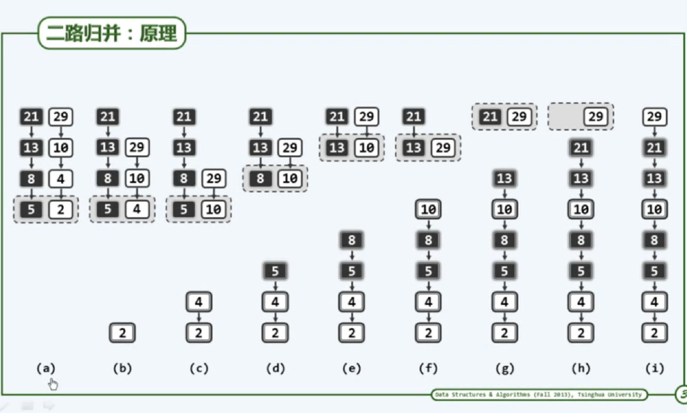
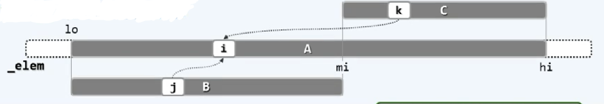

### 仔细缕一下归并排序
#### 代码如下
```c
#include<stdio.h>
#include<stdlib.h>
void merge(int* rank, int lo, int mi, int hi){
    int* A = rank + lo;//合并后的向量A[0, hi - lo) = rank[lo, hi)
    int lb = mi - lo;
    int* B = (int*)malloc(sizeof(int)*lb);//前子向量B[0,lb) = rank[lo, mi)
    //这里用的 i<lb 表示复制的范围是A[0,lb)
    for(int i = 0;i<lb;i++)B[i]=A[i];// 复制前子向量B
    int lc = hi - mi;
    int* C = rank + mi;//后子向量C[0,lc] = rank[mi, hi)
    for(int i=0,j=0,k=0;(j < lb) || (k < lc);){//B[j] 和C[k]中小者转至A的末尾
        if( (j < lb) && (lc <= k || (B[j] <= C[k]) ) )A[i++] = B[j++];//C[k]已无或不小
        if( (k < lc) && (lb <= j || (C[k] < B[j]) ) )A[i++] = C[k++];//B[j]已无或更大
    }// 该循环实现紧凑；但就效率而言，不如拆分处理
    free(B);
}
void mergeSort(int* rank, int lo, int hi){//[lo, hi)
    if(hi-lo<2)return; //处理递归基，单元素区间自然有序
    int mi = (lo + hi)>>1; //以中点为界
    mergeSort(rank, lo, mi);//对前半段排序
    mergeSort(rank, mi, hi);//对后半段进行排序
    merge(rank, lo, mi, hi);//归并
}
```
&emsp;&emsp;归并排序的思想是先将元素拆分，然后合并,如下面这个例子所示。



&emsp;&emsp;显然对区间不停的进行拆分就是重复子问题了，那么显然，递归基便是当排序列表只有一个元素的情况。也就是说当排序列表里面只有一个元素时，就达到了递归结束的条件，直接返回即可。
```c
if(hi-lo<2)return; //处理递归基，单元素区间自然有序
```
&emsp;&emsp;接下来就是没有到达递归结束的时候我们该怎么办了，答案当然以中间点为界限是继续拆分:
```c
    int mi = (lo + hi)>>1; //以中点为界
    mergeSort(rank, lo, mi);//对前半段排序
    mergeSort(rank, mi, hi);//对后半段进行排序
```
&emsp;&emsp;直到拆成排序列表里面只剩一个元素为止，也就是我们所说的递归基,当然这里将一个元素作为递归基的另一个主要原因是，单个元素一定是有序的。
&emsp;&emsp;当我们全部拆到头时，我们就要进行归并(merge)操作了:
```c
void merge(int* rank, int lo, int mi, int hi){
    int* A = rank + lo;//合并后的向量A[0, hi - lo) = rank[lo, hi)
    int lb = mi - lo;
    int* B = (int*)malloc(sizeof(int)*lb);//前子向量B[0,lb) = rank[lo, mi)
    //这里用的 i<lb 表示复制的范围是A[0,lb)
    for(int i = 0;i<lb;i++)B[i]=A[i];// 复制前子向量B
    int lc = hi - mi;
    int* C = rank + mi;//后子向量C[0,lc] = rank[mi, hi)
    for(int i=0,j=0,k=0;(j < lb) || (k < lc);){//B[j] 和C[k]中小者转至A的末尾
        if( (j < lb) && (lc <= k || (B[j] <= C[k]) ) )A[i++] = B[j++];//C[k]已无或不小
        if( (k < lc) && (lb <= j || (C[k] < B[j]) ) )A[i++] = C[k++];//B[j]已无或更大
    }// 该循环实现紧凑；但就效率而言，不如拆分处理
    free(B);
}
```
&emsp;&emsp;merge函数有点复杂，我们慢慢说。首先是参数，merge函数的作用是对[lo, mi)和[mi,hi)两个区间进行归并的，所以参数是一个大数组和它每次要归并两个区间的三个位置参数lo,mi,hi，两个区间归并的例子如下图所示：

&emsp;&emsp;在代码里面的A，B，C三个数组分别大数组中的部分元素，具体来讲A的范围是A[0, hi-lo) = rank[lo, hi),而B[0, mi-lo) = rank[lo,mi),C[0,hi-mi)=rank[mi, hi), A=B+C如下图所示：

&emsp;&emsp;归并时要覆盖A中的B区域，所以要将A中的B区域复制出来，但是C却不需要(仔细想想为什么？)。现在我们再来看看三个区间的代码。
```c
    int* A = rank + lo;//合并后的向量A[0, hi - lo) = rank[lo, hi)
    int lb = mi - lo;
    int* B = (int*)malloc(sizeof(int)*lb);//前子向量B[0,lb) = rank[lo, mi)
    //这里用的 i<lb 表示复制的范围是A[0,lb)
    for(int i = 0;i<lb;i++)B[i]=A[i];// 复制前子向量B
    int lc = hi - mi;
    int* C = rank + mi;//后子向量C[0,lc] = rank[mi, hi)
```
&emsp;&emsp;下面我们就要进行归并了，首先想一下归并的结束条件是什么？当然是两个区间B，C中的数全部归并到大数组A中去了，即：
```c
for(int i=0,j=0,k=0;(j < lb) || (k < lc);)
```
这里循环的执行条件是只要j和k两个位置变量有一个不越界就可以继续执行，其中的lb是B数组的上界，lc是C数组的上界，两个都是开区间，即当取到两个数时，数组已经越界了。接下来就是归并操作了：
```c
    if( (j < lb) && (lc <= k || (B[j] <= C[k]) ) )A[i++] = B[j++];//C[k]已无或不小
    if( (k < lc) && (lb <= j || (C[k] < B[j]) ) )A[i++] = C[k++];//B[j]已无或更大
```
&emsp;&emsp;难点在于条件,要归并的前提是准备归并的数组没有越界(j < lb)，还有一个条件是另外一个数组已经越界了，或者是另外一个数组没有越界，但是当前数组的值小于另外一个数组的值，这就是(lc <= k || (B[j] <= C[k]) )条件的由来，这时就应该明白为什么循环的结束条件是两个数组同时越界了吧。最后释放临时数组B的空间。到此归并排序也就结束了。